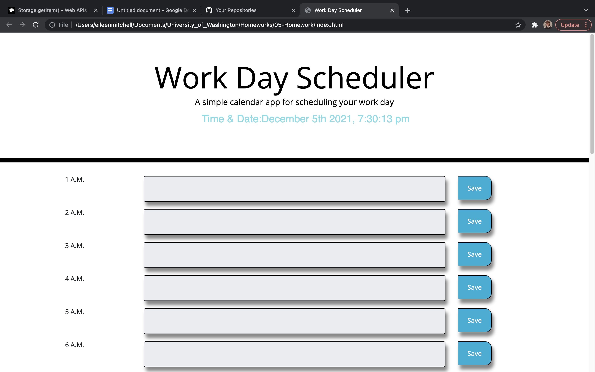

# DYNAMIC DAY CALENDAR

By: Eileen Mitchell

A DAY CALENDAR TO TRACK YOUR ACTIVITY AND SCHEDULE

# Technologies Used

- HTML
- CSS
- JQUERY

# Description 

This website allows users to create a day calendar to track you activity and schedule throughout the day. The calendar includes the time updated every second for accuracy. You may dynamically select timeslots for the hour that works for you. If it is a future hour, those times will appear green, present hours appear red, and past hours appear grey. Past hours are read only and you may not select times within them, since they have already passed. Once you save the data in the calendar, it will save locally and will appear the next time you open this page. 

This calendar was created dynamically and uses JQuery to create most of the elements within the file itself. HTML does exist but takes a backseat in this application. 

# Tools Used

More use of for loops was used to develop the times for the calendar within this application. Other useful tools included local storage, bootstrap, else if statements, etc. I am most pleased with bootstrap, as it has allowed us to find new code and grab appropriate syntax to plug into our code and develop applications much faster than we would have for items that would have been rather difficult to create otherwise. Even if it is difficult, you can figure it out a bit easier after using bootstrap.

# Alternative Code Options

I would like to learn how to have used STRINGIFY in my code. Next time I would like to change it to include this. I originally created my code using static HTML and would like to have finished the code using static HTML to see how to finish that code with the static version as well. However the current code is good and I understand it and it works well.

# Problems with the Code

The code is written to include all hours of the day. Code was checked after hours and it breaks the code for any available hours, therefore wrote code to incorporate all hours.

# Links

866/144791394-35d69dd5-716f-48e5-8781-52166a069526.jpg)

- [index.html](./index.html)
- [script.js](./script.js)
- [style.css](./style.css)

# Screen Shots

